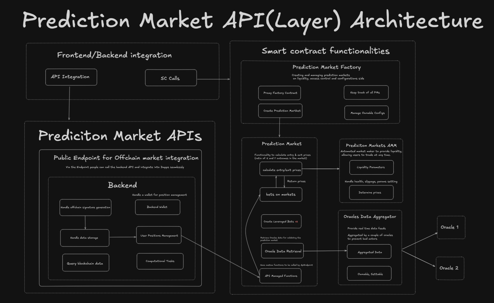

# Prediction Market API 
A hot new prediction market platform just dropped! This one allows users to create and participate in prediction markets across blockchain networks, betting on outcomes with potential rewards based on accurate predictions. The selling point of this exciting protocol is its easy plug-and-play solution, designed to simplify integration and empower developers to build innovative features on top of it.

## Table of Contents

- [Prediction Market API](#prediction-market-api)
  - [Table of Contents](#table-of-contents)
  - [Overview](#overview)
    - [What We Need](#what-we-need)
  - [Architecture](#architecture)
- [Prerequisites](#prerequisites)
  - [Setup](#setup)
  - [Backend](#backend)
    - [Setup](#setup-1)
    - [API Endpoints](#api-endpoints)
    - [Error Handling](#error-handling)
    - [Development Notes:](#development-notes)
  - [Frontend](#frontend)
  - [Smart Contracts](#smart-contracts)
    - [MarketFactory (Upgradeable):](#marketfactory-upgradeable)
    - [Market:](#market)
    - [Market AMM:](#market-amm)
    - [Oracle implementation (MockOracle)](#oracle-implementation-mockoracle)

## Overview

This repository requires building new features, enhancing functionality, or optimizing performance for a Prediction Market API MVP. The platform comprises:

- **Backend Service** for market management (written in NestJS, using Web3.js for blockchain interactions).
- **Frontend** for seamless user interactions.
- **Smart Contracts** for secure and decentralized operations on Ethereum-compatible networks.

### What We Need

- Efforts on **two or more** of the following stacks:
  - Frontend
  - Backend
  - Smart Contracts

- Thoughtful solution design:
  - **Comprehensive Feature Set**
  - **Backend/Frontend composability**
  - **Smart contract gas efficiency**
  - **Readability**
  - **Security**
  - **Scalability**
  - **Usability / UX**
  - **Robustness** (with tests!)
  - **Technical prowess**
  - **Documentation**
- **Tradeoffs** and **Compromises** noted where relevant.

Pretend you're drafting a real protocol. Think about gas, UX, practicality, security, etc. While it's not necessary to find the perfect solution, we do want to see a viable solution that works and shows your thought process. If applicable, point out the shortcomings/compromises of the solution and how you think it could be improved with more time. Feel free to even criticize the protocol you're integrating. You can leave your thoughts in comments or a in separate doc-- the more the merrier!

There is no set formula for scoring, but the more believable and shippable the protocol is, the better. We'll evalute your solution as a whole across these various aspects. Use your best judgement, and if you feel that any particular tradeoffs were necessary, feel free to note them.

Don't hesitate to reach out if you have any questions.

## Architecture



The diagram above outlines how the **frontend**, **backend**, and **smart contracts** communicate:

1. **Frontend** sends requests to the **backend** API (e.g., create market, fetch all markets).
2. **Backend** uses **Web3.js** to interact with deployed smart contracts (e.g., `MarketFactory`, `Market`).
3. **Smart Contracts** (using Ethereum-compatible networks) handle decentralized logic for market creation, betting, and settlement.

# Prerequisites

- [pnpm](https://pnpm.io/installation) version: >=`9.13.1`
- Version check: `pnpm --version`

Installation of `pnpm`:

```bash
npm install -g pnpm@latest
```

## Setup

Run:

```
make setup
```

## Backend

The **backend** is built using the NestJS framework and interacts with Ethereum-compatible networks. It exposes RESTful endpoints for **market creation** and **market retrieval**.

### Setup

1. **Install dependencies**:

```
npm install
```

Configure environment variables:

Rename .env.example to .env.
Insert your wallet’s private key:

    WALLET_PRIVATE_KEY="your key here"

We’ve used Sepolia for the _MARKET_FACTORY_ADDRESS_ in the **.env.example**, but feel free to deploy on any testnet and document it in your solution.

Start the application:

```
npm run start
```

The server will run on http://localhost:3000 by default (configurable in NestJS).
Chain Configuration

The application supports multiple chains through chains.config.ts. For each chain, you must specify:

```
{
  chainId: number;      // e.g. 1 for Ethereum Mainnet
  rpcUrl: string;       // e.g. "https://mainnet.infura.io/v3/..."
  networkName: string;  // e.g. "mainnet"
}
```

Make sure to include the chainId as a query parameter when calling the endpoints (e.g. ?chainId=1).

### API Endpoints

Note: Both "_GET /markets_" and "_POST /markets/create-market_" **require** the query parameter **chainId** (e.g. ?chainId=1).

Create Market

```
POST /markets/create-market
```

Creates a new prediction market on the specified chain.

Request Body Example:

```
{
  "question": "Will BTC reach $100k in 2024?",
  "outcomes": ["Yes", "No"],
  "endDate": 1703980800,
  "initialLiquidity": "1000000000000000000"
}
```

Body example broken down:

```
question (string, required): The market question.
outcomes (string[], required): Array of possible outcomes.
endDate (number, required): Unix timestamp for market end date.
initialLiquidity (string, required): Initial liquidity in wei.
```

Get Markets

```
GET /markets/
```

Retrieves all markets that have been created by the MarketFactory on the specified chain.

Response Body Example:

```
[
  {
    "marketAddress": "0x...",
    "marketName": "TestMarket",
    "outcomeCount": "2",
    "userBets": "4"
  },
  ...
]
```

### Error Handling

```
200: Success
```

```
400: Bad Request
```

```
500: Internal Server Error
```

### Development Notes:

Built with NestJS.
Uses Web3.js for blockchain interactions.
Implements DTO validation using class-validator.

## Frontend

Install dependencies:

```
npm install
```

Start the application:

```
npm run start
```

By default, it runs on http://localhost:3001 (or another port as specified in your frontend settings).

The frontend includes:

- User Flow: Create a market, place bets, and view existing markets.

- Interaction with the Backend: Simple forms to send requests to the backend endpoints. (Hint: _Idea here is to proove that the plug and play is as easy and seamless as possible!_)

Feel free to use frameworks like React, Next.js, or others. Customize as you see fit, but keep an eye on user experience (UX) and usability.

## Smart Contracts

The core logic for the protocol resides in the smart contracts. These contracts are written in Solidity and can be deployed on any Ethereum-compatible network. We've used Sepolia for the "MARKET_FACTORY_ADDRESS" in the .env.example, but feel free to deploy on any testnet and make sure to document it!

### MarketFactory (Upgradeable):

- Acts as a factory pattern contract that creates and manages individual Market instances.
- Stores a reference to the Market implementation contract.
- Can create new Market instances using a designated function (e.g., createMarket).
- Keeps track of all created markets for easy enumeration.
- Contains initialization logic for use with a proxy pattern upgrade approach.

### Market:

Each Market instance handles user betting logic:

- Tracks outcomes and user positions.
- Holds liquidity and manages reward distribution.
- Integrates with an oracle (such as MockOracle) to settle the market outcome.

### Market AMM:

- Used to hold all of the math for the smart contracts

### Oracle implementation (MockOracle)

- Represents an external data provider for outcome verification.
  In production, a real oracle might fetch data from trusted APIs (e.g., Chainlink). For demonstration, manually set the outcome.
